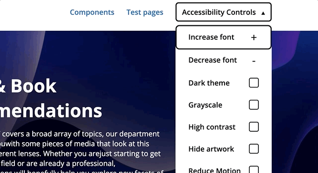

# Responsible-IT Website

> The Responsible IT lectureship works on methods and techniques for developers, designers, product owners and users, so that from their roles they can contribute to digital products that are reliable, safe, fair and have people's trust.

# Keuzes die zorgen voor een verantwoorde website

Binnen dit project zijn verschillende keuzes gemaakt om ervoor te zorgen dat de website zelf ook zo verantwoord mogelijk is. Denk hierbij aan het toegankelijk maken van de website, maar ook het zorgen dat de website zo min mogelijk resources vereist (en dus zo min mogelijk CO2 verbruikt).

## Toegankelijk voor iedereen

De website is zo toeganlijk mogelijk gemaakt voor iedereen. Dit houdt in voor zoveel mogelijk mensen, ook mensen met een beperking, maar ook op zoveel mogelijk devices (mobiel & desktop, oude & nieuwere browsers). Dit is mogelijk gemaakt door het schrijven van lichte en compacte code zonder overbodig gebruik van teveel nieuwe technologieën, en zonder een framework. Waar wenselijk worden wel nieuwe technieken gebruikt om de gebruikerservaring te verbeteren.

### Skip to main content

Om de ervaring voor gebruikers met enkel een toetsenbord of screenreader te verbeteren is er een 'Skip to main content' knop toegevoegd. Hierdoor kunnen gebruikers met 1 klik op de knop de navigatie skippen en gelijk naar de content van de pagina gaan.


### Betere focus states

Ook zijn er duidelijke focus states toegevoegd op elementen die dit moeten hebben. Deze zijn een stuk beter te zien dan de standaard states van de browser.


### Aria labels

Waar nodig zijn Aria labels toegevoegd om de screenreader ervaring te verbeteren

```html
<button aria-label="open or close accessibility controls menu"></button>
```

### Accessibility Controls

Er is een menu gecreëerd om de website naar eigen wensen aan te passen. Zo kun je de lettergrootte wijzigen, verschillende filters toevoegen voor slechtziende, een donkere of lichte modus kiezen en animaties verminderen. Al deze instellingen worden opgeslagen op het device van de gebruiker, in Local storage. Mocht er nog niks geselecteerd zijn, dan wordt er gekeken naar de instellingen van het device. Staat jouw device in dark mode, dan krijg je deze website ook in dark mode. Heb jij aanstaan dat je minder animaties wilt? Dan krijg je dat hier ook.



### Duidelijke navigatie

Overal is rekening gehouden met de navigatie zo duidelijk mogelijk te houden. Je hebt overzichtpagina's met daarin een sub menu van de verschillende detailpagina's. Ook heeft elke pagina die in een andere pagina zit een breadcrumb menu. Zo kan je gelijk zien waar je bent, maar kan je ook terug navigeren naar vorige pagina's


### Goed contrast

Overal is rekening gehouden met een goed contrast. Elk onderdeel scoort _WCAG AAA_, het hoogste mogelijk. Dit zorgt voor een goede leesbaarheid. Ook is er een duidelijk font gebruikt met de juiste font weights.


### Leesbaarheid

Om de leesbaarheid nog beter te maken is er voor gezorgd dat teksten niet te lang worden. Uit onderzoek blijkt dat rond de 75 karakters per regel de max is. Hier is rekening mee gehouden en teksten op deze website zullen nooit breder zijn dan 75 karakters.


## Performance

De website is zo lichtgewicht mogelijk gemaakt. Dit om te zorgen dat de gebruikers ervaring zo goed mogelijk is en om te zorgen dat de website zo min mogelijk CO2 uitstoot bij het gebruik. Dit is op de volgende manieren gedaan.

### Zo min mogelijk code

De eerste klinkt simpel maar is één van de belangrijkste dingen. Zo min mogelijk code. Geen overbodige code of frameworks en enkel code die noodzakelijk is.

### Geoptimaliseerde afbeeldingen

Voor logo's wordt zoveel mogelijk .svg gebruikt vanwege de kleine bestandsgrootte. De afbeeldingen die er zijn zijn allemaal zo klein mogelijk gemaakt met _tinypng_.

### Artwork

Omdat afbeeldingen alsnog zwaar kunnen zijn, en we toch niet een geheel saaie website wilde hebben is er een artwork in CSS gemaakt. Dit artwork is veel kleiner dan een normale afbeelding en is een stuk interessanter. Er zit een animatie in en elke keer dat de pagina laadt wordt er een nieuw artwork gegenereed met andere kleuren.


### Minify & combineren

Iets wat nog niet is gedaan, maar in productie wel moet is het combineren van de CSS bestanden en het minify'en ervan. Het combineren ervan is van belang omdat er nu voor ieder component een request naar de server wordt gedaan middels een `@import`. Dit is gedaan om tijdens developen de code van verschillende compenenten gescheiden te houden. Ook kan deze code vervolgens geminified worden om een zo klein mogelijk bestand te genereren.

### Hosting

Om in het kader van verantwoord bezig zijn te blijven is er gekozen voor een hosting die volledig CO2 neutral is.

## Uitkomst

De uitkomst van al deze dingen is een prototype van een website, die middels een CMS en genoeg content zo live kan worden gezet. De website krijgt een Lighthouse score van 100% op zowel performance, accessibility, best practices & SEO.


~ Mark van Heusden 16-07-2022
